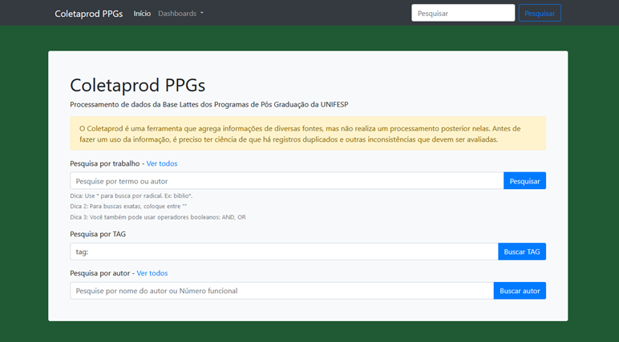
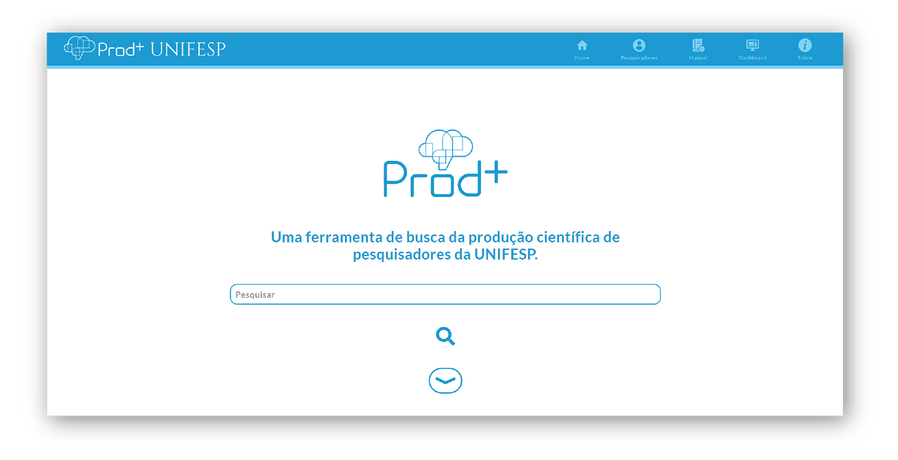

# Prodmais — Visual Identity


[Prodmais Hotsite](https://unifesp.br/prodmais/promo/)  
[Visit Prodmais](https://unifesp.br/prodmais/)


## About Prodmais

Prodmais is a tool that aggregates information about academic productions from different sources, mainly the Lattes database. Prodmais allows you to carry out specific searches in the database and filter the results with the support of the different filter options that the tool has. It also allows you to search for researchers, and has filtering by area of expertise, Campus, language, publication date, education level, in short, several options. It is possible to export the results using formats supported by several bibliographic software, and it is also possible to export all the information of a profile to ORCID. 


This tool is idealized by [Alexsandro Cardoso](https://orcid.org/0000-0002-9556-2908), developed and maintained by [STI](https://sti.unifesp.br), and has [Tiago Murakami](https://github.com/trmurakami) as its main programmer, and me as a graphic and frontend designer.


### Prodmais before my entry into the project

<p align="center">
  
</p>

### My role in this project

- create a logomark and a visual identity
- make a redeseign into *Home* page
- create *About* page
- create a manual online
- create a hotsite


## My Work

### Visual identity

You also can it see on [Behance](https://www.behance.net/gallery/122041173/Prodmais-identidade-visual).

#### Logomark

Created using my own metodology of logos creations. 


#### 1) Concepts

<p align="center">
  
</p>


**Brain** — Academic production  
**Cloud** — Cloud computing

#### 2) Construction

<p align="center">
  
</p>


**Brain + Cloud** — A whole composed of various components. A symbol that demonstrate that the production of knowledge is extensive and steeped in the production of prior knowledge. 

#### 3) Composition

<p align="center">
  
</p>


**Typography** — Created with the smae elements at the logo sign.


#### The result

<p align="center">
  
</p>


#### Home page

I followed a minimalist line with use of white space and less information. *Less is more.* 

<p align="center">
  
</p>


**A diferent presentation in mobile devices**

<p align="center">
  
</p>

## Coding

Prodmais was developed in [*Laravel*](https://laravel.com), and using an architecture where the *view* is dynamically built from the *model*. Its working with *PHP*, *ElasticSearch*, *Curl*, *Composer* and the connection parameters with the data sources. I had a lot of problems  to create a fully functional instance on my machine, so the approach I used for styling the home was to recreate the interface as closely as possible in HTML and then apply the styling. So, the back-end developer would only need to apply the *CSS* classes, plus a few minor tweaks. 

I used [Jekyll](https://jekyllrb.com), a framework that use HTML, CSS, SASS in a way that lets you work with in [*Don't Repeat Yourself*](https://en.wikipedia.org/wiki/Don%27t_repeat_yourself) style. 


### SASS

sass was a great tool that helped me organize all the CSS I created for the project. My way or use SASS: 

#### My structure: ABC

> |- **Abstracts**  
>   |- _breakpoints.sass  
>   |- _functions.sass  
>   |- another helpers  
> |- **Base**     
>   |- _normalize.scss  
>   |- _theme.scss  
>   |- _tipography.scss  
> |- **Components**  
>   |- header.sass  
>   |- footer.sass  
>   |- images.sass  
>   |- etc  


#### Writting smart code

```sass
$sizeH: (
	1: 2rem,
	2: 1.7rem,
	3: 1.2rem,
	4: 1rem
); 

@each $n, $size in $sizeH {
  h#{$n} {
      font-size: $size;
  }
}

```

**Simple helpers that help me a lot**

```sass
.div-h, .div-v
  @include flex(column, center, center)
  width: 100%

@include breakpoint(md-up)
  .div
    &-h
      flex-direction: row
      justify-content: center
```

**Sass boilerplate components**

I used some functions of [Sass boilerplate](https://github.com/KittyGiraudel/sass-boilerplate) created by [Kitty Giraudel](https://github.com/KittyGiraudel).

---

Visit Prodmais on <https://unifesp.br/prodmais/>


**Thanks!**  
[*Ricardo Ireno*](https://github.com/RicardoIreno/)
