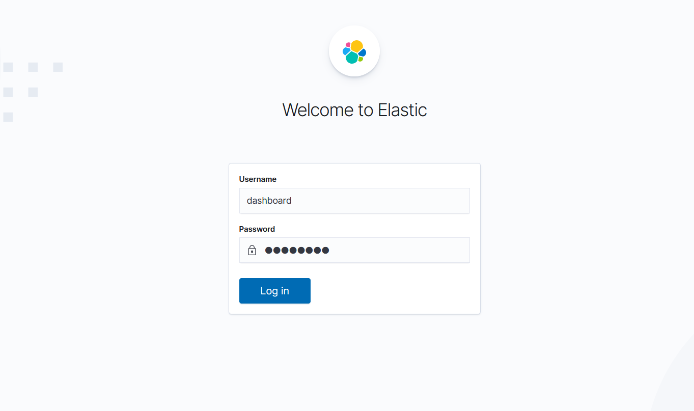
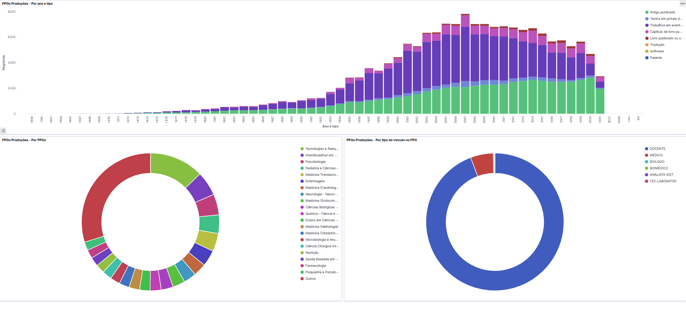

# Dashboards

O Prodmais utiliza a ferramenta *Elastic Search* para oferecer um poderoso *dashboard* com dados detalhados sobre a base de produção acadêmica. O Prodmais oferece dois *dashboards*: O *dashboard* de Produção Acadêmica, e o *dashboard* de Perfil dos Pesquisadores.

> Para acessar, preencha ambos os campos *Username* e *Password* com a palavra ***dashboard***

O conteúdo da tela se carregará com gráficos como este:

Os gráficos são interativos e se modificam filtrando a informação quando você clica em 
cada categoria de informação exibida. Então, a cada ação de filtragem, o gráfico exibe informações cada vez mais afuniladas sobre determinada informação. Para voltar ao estado anterior do gráfico utilize a seta "voltar" do seu navegador.

*Clicando nas partes do gráfico, novas informações são carregadas a partir de suas  subcategorias.*

### Nuvem de tags

A núvem de tags facilita a pesquisa por tópicos com maior volume de produção:

Clicando em uma tag, o *dashboard* se atualiza com as novas informações.
