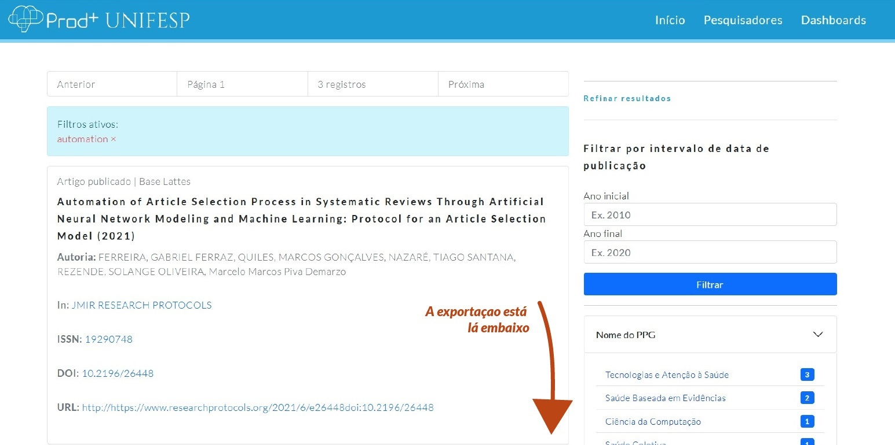
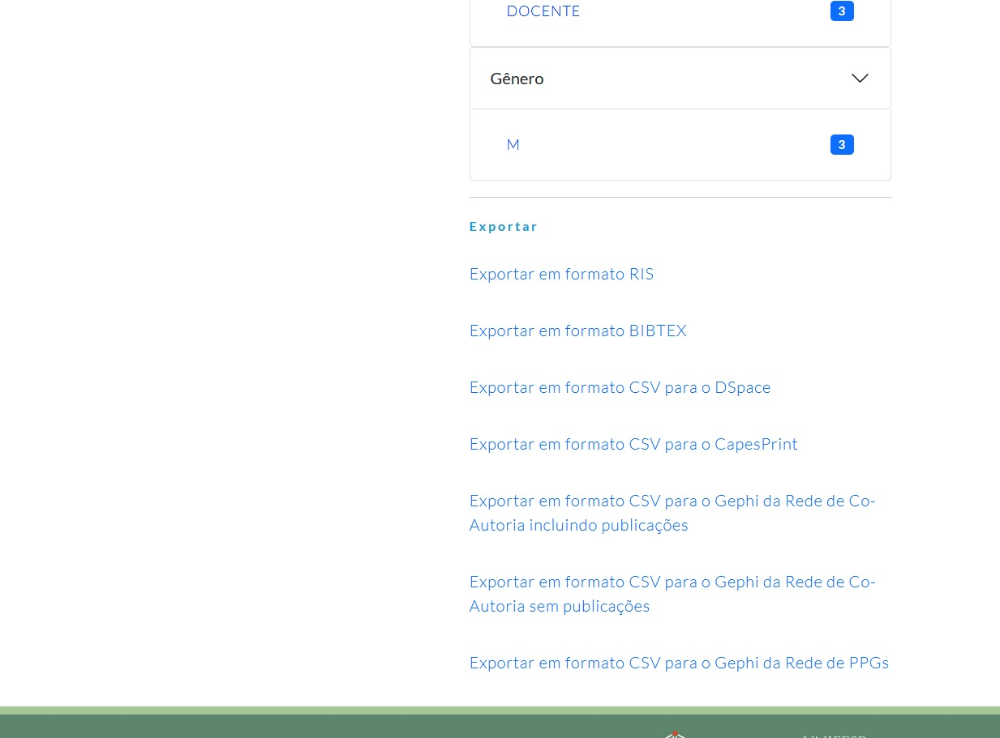
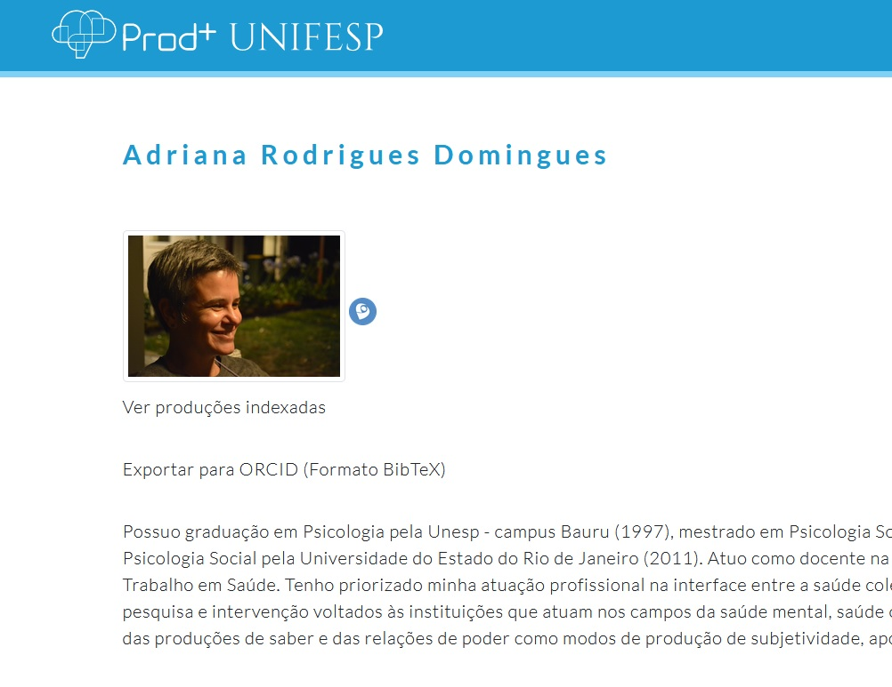

# Exportação {#exportacao}

O Prodmais permite a exportação dos metadados da sua pesquisa nos formatos RIS, BIBTEX e diferentes formatações de CSV. Uma vez feita a pesquisa, as opções de exportação aparecem ao final da seção de filtros no lado direito da página. Basta deslizar até o final da página e escolher um formato de exportação.

Você encontrará as opções de exportação na parte inferior direita da página, logo abaixo das opções de filtragem:

## Os formatos disponíveis:
 

### RIS

Um arquivo RIS é um arquivo de citação bibliográfica salvo em um formato desenvolvido pela Research Information Systems (RIS). Os arquivos RIS são salvos em um formato de texto ASCII, e são suportados por programas com o EndNote, Wandora e BibDesk.

| **Programas que suportam o formato RIS**
|--------------------------------------------
| **Windows**   | Thomson Reuters EndNote
| **Linux** 	  | Wandora
| **Macintosh** | Thomson Reuters EndNote

### BIBTEX

BibTeX é uma ferramenta de formatação usada em documentos LaTeX. Ela foi criada para facilitar a separação da bibliografia com a apresentação do texto, seguindo o mesmo conceito da distinção do conteúdo com o estilo do texto utilizada no próprio LaTeX e XHTML.

| **Programas que suportam o formato BibTeX**
|--------------------------------------------
| **Windows**   | TeXnicCenter
| **Linux** 	  | Bib2x, JabRef, Pybliographer, RefTeX
| **Macintosh** | BibDesk

### CSV

Um arquivo CSV é um formato extremamente de arquivo de valores separados por vírgula normalmente usado por diversos tipos de programas, desde os mais simples, como o Bloco de Notas, até editores de planilhas como o Microsoft Excel ou o OpenOffice Calc.

No Prodmais é possível exportar os dados em CSV formatados para o DSpace, o CapesPrint, e o Gephi.

## Exportação dos dados do Lattes para o ORCID

Manter o currículo Lattes e o ORCID igualmente atualizados é uma tarefa trabalhosa. O Prodmais oferece uma forma fácil de transferir os dados do currículo Lattes para o ORCID através de uma exportação em formato BibTeX. E de uma forma simples. Basta usar a opção *Exportar para ORCID (Formato BibTeX)* na página do seu perfil de pesquisador, que pode ser pesquisada a partir da aba Pesquisadores:

