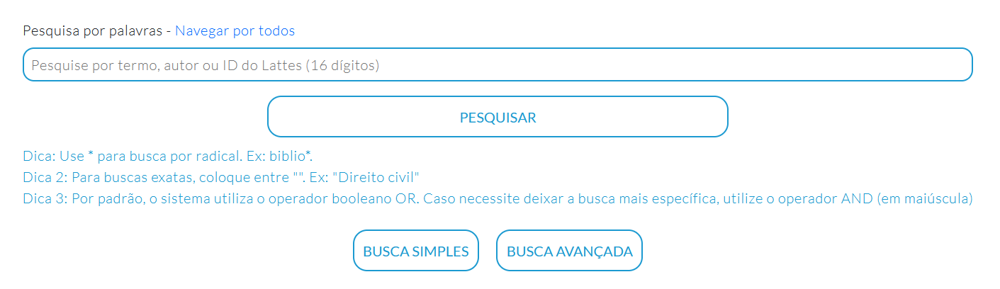
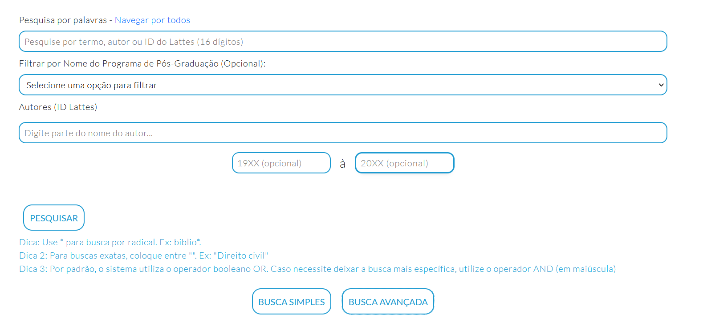
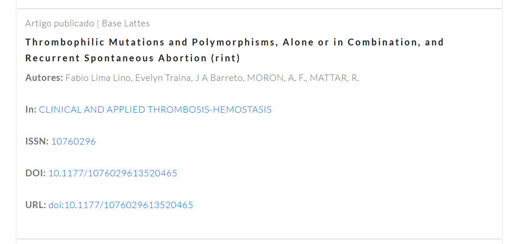
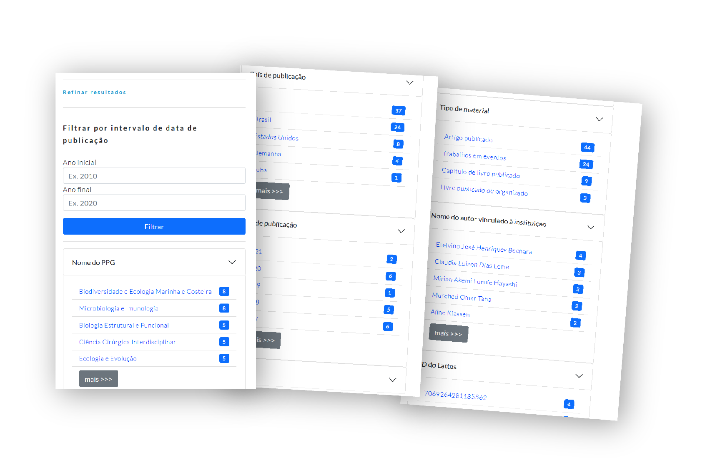
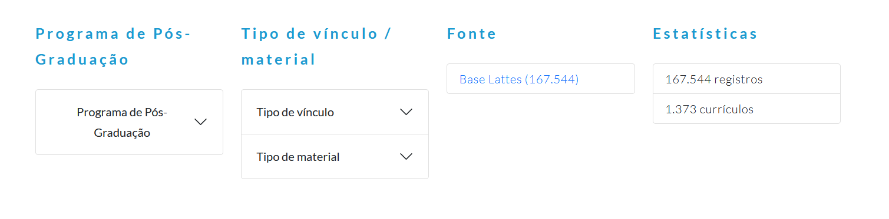

# Realizando Pesquisas

Na tela inicial do Prodmais, é possível alternar entre pesquisa simples e pesquisa avançada:

### Pesquisa simples por palavra chave {#pesquisa-simples}

### Pesquisando pela busca avançada {#pesquisa-avancada}

#### Como o resultado é mostrado

Cada item retornado da pesquisa será mostrado assim:

Oferecendo informações sobre:

- Título
- Autores
- IN
- E se houver, também
 - ISSN
 - DOI
 - URL

#### Opções de filtragem na página de pesquisa por palavra chave

Existem muitos outros filtros disponíveis ao lado direito da página de resultados:

**Os filtros disponíveis são:**

- Filtrar por intervalo de data de publicação
- Ano da publicação
- País da publicação
- Cidade
- Campus
- Unidade
- Divisão
- Departamento
- Seção
- Gestora
- Título do periódico
- Tipo de Vínculo
- Nome do PPG
- Idioma
- Gênero
- Nome do autor vinculado à instituição
- Nome da grande área de conhecimento
- Nome do evento
- ID do Lattes
- Natureza
- Tipo de material
- Meio de divulgação

### Pesquisando por autor {#pesquisa-autor}

No cabeçalho do site do Prodmais, ao lado direito, há também a opção "Pesquisadores". 

Clicando nela, você terá uma lista em ordem alfabética dos presquisadores cadastrados na base de dados. A partir daí, é possível refinar a sua pesquisa através dos filtros disponíveis. 

Na página do autor você encontra uma breve descrição

**Os filtros disponíveis são:**

- Campus
- Gestora
- Unidade
- Departamento
- Divisão
- Seção
- Nome o PPG
- Tipo de vínculo
- Gênero
- Nacionalidade
- País de Nascimento
- Nome da instituição ou empresa
- Nome do órgão
- NOme da unidade
- País de endereço profissional
- Cidade de endereço profissional
- Instituição em que cursou graduação
- Nome do curso na graduação
- Status do curso na graduação
- Instituição em que cursou mestrado
- Nome do curso no mestrado
- Status do curso no mestrado
- Instituição em que cursou mestrado profissional
- Nome do curso no mestrado profissional
- Status do mestrado profissional
- Instituição em que cursou doutorado
- Nome do curso no doutorado
- Status do curso no doutorado
- Instituição em que cursou livre docência
- Maior formação que iniciou  
- Filtrar por ano da publicação

### Pesquisando por tópicos na página principal {#pesquisa-topicos-home}

Também é o possível realizar a pesquisa a partir dos principais tópcios que se encontram na parte inferior da página inicial. 

Nela, é possível navegar pela base através dos seguintes caminhos:

- Programa de Pós-Graduação
- Tipo de vínculo / material
  + tipo de vínvulo
  + tipo de material

- Base Lattes